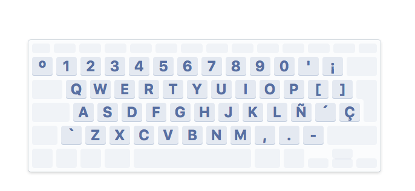

# A Spanish keyboard layout

## Installation

### macOS

1. Copy `aukey_vowels.keyboard` into:
	- `/Library/Keyboard Layouts/` to install the layout for all users
	- `~/Library/Keyboard Layouts/` to install the layout only for the current user.
2. Add the layout as an input source by navigating to _System Preferences > Keyboard > Input Sources_. Click the add button, search by "Other" and install
3. You can enable the _Show input menu in menu bar_ option to quickly switch between keyboard layouts.
